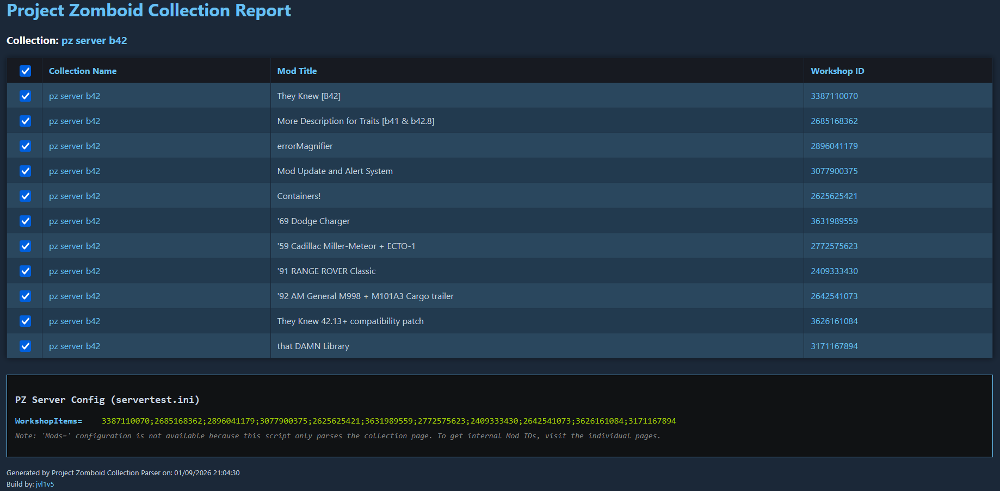

# Project Zomboid Collection Parser 🧟‍♂️📦

A lightweight PowerShell tool designed for **Project Zomboid Server Admins** who manage their mods via Steam Workshop Collections.

This script parses a public Steam Workshop Collection page and generates a clean HTML report. It extracts all **Workshop IDs** from the collection, making it easy to populate your `servertest.ini`.

## ✨ Features

*   **Collection Parsing:** Fetches a Steam Workshop Collection page by ID.
*   **HTML Report:** Generates a visual report listing every mod found in the collection.
*   **Config Generator:** Automatically generates the `WorkshopItems=...` string for your server configuration.
*   **Direct Links:** Provides quick links to the individual mod pages for further inspection.

### ⚠️ Important Limitation
This script extracts the `Workshop ID` (e.g., `2890530068`).
It does not extract the internal `Mod ID` (e.g., `tsarslib`). Use the **Mod Parser** tool located in the `../mod-parser` directory for this case with the IDs scraped with this Collection Parser.

## 🚀 Usage

### 1. Run the Script
Open PowerShell in this directory and run the script. You must provide the `CollectionId` parameter (the script will ask for the CollectionID if it is not given as a parameter)

```powershell
.\ProjectZomboidCollectionParser.ps1 -CollectionId <Your_Collection_ID>
```

**Example:**
```powershell
.\ProjectZomboidCollectionParser.ps1 -CollectionId 2869562768
```

### 2. Check the Result
The script will generate `ProjectZomboidCollectionReport.html` in the same folder and automatically open it.

*   **Review:** See the list of mods included in your collection.
*   **Copy Config:** Scroll to the bottom to copy the `WorkshopItems=...` line.



## 📋 Requirements

*   Windows Operating System
*   PowerShell 5.1 or newer
*   Internet connection (to fetch Steam pages)
