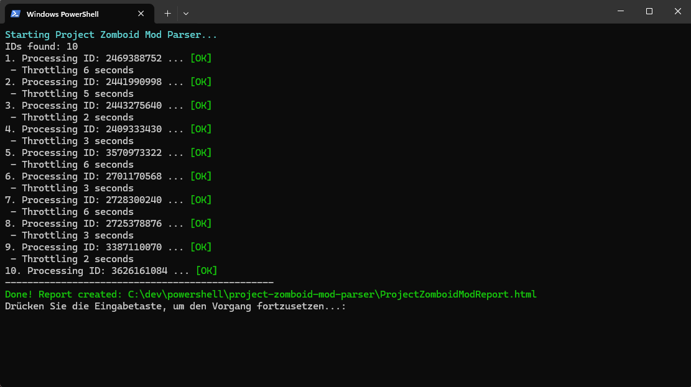
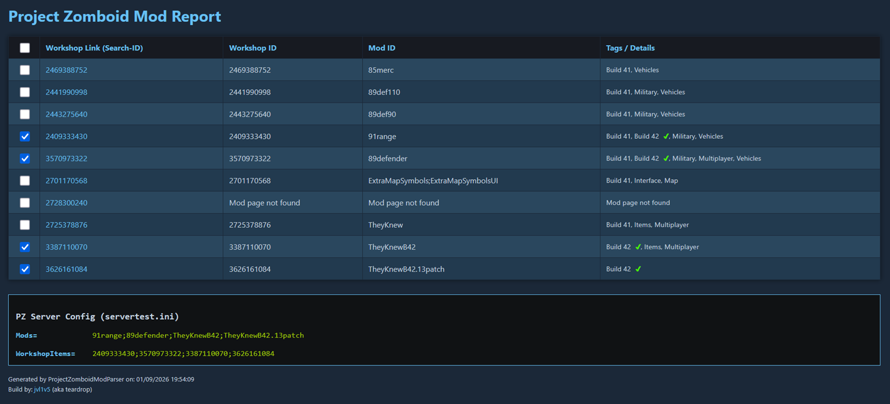

# Project Zomboid Mod Parser 🧟‍♂️🛠️

A handy PowerShell tool designed for **Project Zomboid Server Admins**.

This script automates the process of retrieving mod information from the Steam Workshop. It reads a list of Workshop IDs, parses the webpages for relevant details (Mod ID, Workshop ID, Tags), and generates a clean HTML report. Crucially, it also generates the formatted configuration lines required for your `servertest.ini`.

## ✨ Features

* **Automatic Parsing:** Fetches Steam Workshop pages based on a provided ID list.
* **Interactive HTML Report:** Generates a report with checkboxes, allowing you to easily select/deselect mods for your server config.
* **Tag Highlighting:** Automatically highlights specific tags (Default: **"Build 42"**) with a green checkmark ✅.
* **Server Config Generator:** Generates copy-paste ready lines for your `servertest.ini` at the bottom of the report based on your selection:
    * `Mods=...`
    * `WorkshopItems=...`
* **Randomized Throttling:** Includes a configurable random delay between requests to prevent IP bans from Steam.
* **Robust Error Handling:** Automatically retries failed requests and aborts if too many consecutive errors occur.
* **Clean Output:** Removes unnecessary links from the tag description for better readability.

## 🚀 Installation & Usage

### 1. Download the Script
Download the file `ProjectZomboidModParser.ps1` and save it to a folder of your choice.

### 2. Create the ID List
Create a text file named `PZ_Mod_IDs.txt` in the **same folder** as the script.
Paste the Workshop IDs of the mods you want to use into this file. The IDs must be separated by **semicolons**. Newlines are allowed and will be handled automatically.

**Example `PZ_Mod_IDs.txt`:**
```text
2890530068;2460351205
1234567890;987654321
```

### 3. Run the Script
Execute the script using PowerShell:

1.  Right-click on `ProjectZomboidModParser.ps1` -> **Run with PowerShell**.
2.  *Or* via Terminal:
    ```powershell
    .\ProjectZomboidModParser.ps1
    ```



### 4. Check the Result
The script automatically generates a file named `ProjectZomboidModReport.html` in the same folder and opens it.

*   **Review Mods:** Check the details and tags for each mod.
*   **Select/Deselect:** Use the checkboxes to include or exclude specific mods.
*   **Get Config:** Scroll to the bottom to find the dynamic config strings (`Mods=...` and `WorkshopItems=...`) updated based on your selection.



---

## ⚙️ Configuration

You can easily customize the script by editing the variables at the top of the `.ps1` file:

### Highlighting Tags
By default, the script looks for "Build 42". You can add more tags to the `$SearchTags` list:

```powershell
$SearchTags = @(
    "Build 42",
    "Map",
    "Vehicle"
)
```
*If one of these keywords is found in the mod details, a green checkmark will be appended to it in the report.*

### Throttling (Speed)
To avoid overloading Steam (and risking temporary IP bans), the script waits a random amount of seconds between requests. You can adjust the range here:

```powershell
$ThrottleSecondsMin = 5
$ThrottleSecondsMax = 15
```

### Retry Configuration
Configure how the script handles network errors or Steam timeouts:

```powershell
$RetriesMax = 5            # Number of retries per ID
$RetryPauseSeconds = 30    # Wait time before retrying
$MaxConsecutiveErrors = 3  # Abort script after this many back-to-back failures
```

### URL Definition
If the Steam Workshop URL structure changes, you can adjust the base URL here:

```powershell
$BaseUrl = "https://steamcommunity.com/sharedfiles/filedetails/?id="
```

---

## 📋 Requirements

* Windows Operating System
* PowerShell 5.1 or newer (Standard on Windows 10/11)
* Internet connection (to fetch Steam pages)

## ⚠️ Disclaimer

This tool uses "Web Scraping" to analyze public Steam Workshop pages. If Valve/Steam significantly changes the layout of their website, the script (specifically the Regex patterns) may need to be updated.

---

**Created for the Project Zomboid Community.** ❤️